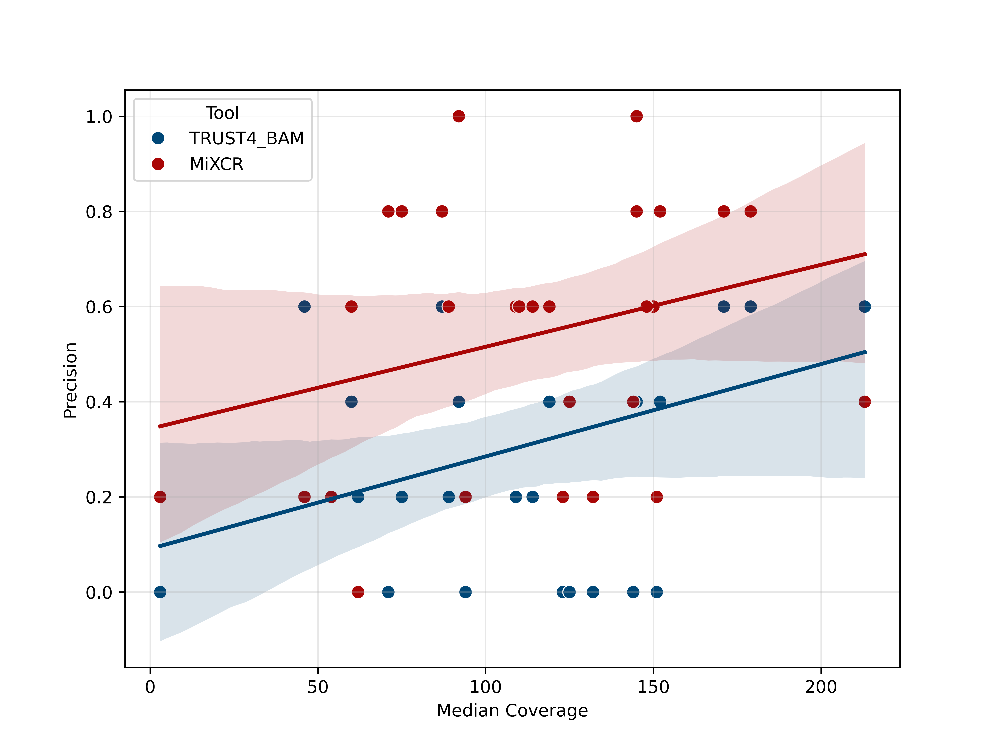

# Clonotype identification tools
Evaluating TRUST4 and a custom MiXCR pipeline against the standard MiXCR workflow: IGV‑validated comparison 

## Analysis Workflow Summary

This project compares immune repertoire analysis tools by validating results against visual inspection in IGV. Below is the step‑by‑step workflow.

### 1. Input Data & Reference Selection
- We started with major clones identified by the standard MiXCR pipeline.

### 2. IGV‑Based Validation of Ig Genes
- For each major clone, we inspected the corresponding BAM files in IGV (Integrative Genomics Viewer).
- Goal: confirm the presence and structure of immunoglobulin (Ig) genes (e.g., V/D/J segments) supporting each clonotype.
- Criteria checked:
  - Read coverage across V(D)J regions
  - Splice junctions and alignment quality
  - Absence of artifacts or misassemblies

### 3. Re‑Analysis with Alternative Tools

Using the same input data (BAM files), we ran to compare against the standard pipeline’s output:
- **TRUST4**
- **MiXCR** (custom run)

#### BAM File Preparation for TRUST4 and MiXCR

To focus the analysis on immunoglobulin gene regions, we performed targeted extraction using GENCODE annotations:

Region selection:
- Extracted genomic intervals corresponding to immunoglobulin genes (e.g., IGH, IGK, IGL) from the GENCODE annotation file (v43, GRCh38).
- Generated a BED file listing coordinates of all Ig‑related exons and introns.

Targeted BAM subsetting:
- Used samtools view to filter the original BAM files, retaining only reads mapped to Ig regions:
<pre>
samtools view -b -L ig_regions.bed input.bam --write-index -o ig_subset.bam
</pre>

FASTQ conversion:

Converted the filtered BAM file to FASTQ format using Picard’s SamToFastq tool (v2.27.4):

<pre>
java -jar picard.jar SamToFastq -I input.bam -F input_R1.fastq.gz -F2 input_R2.fastq.gz --VALIDATION_STRINGENCY SILENT
</pre>

#### MiXCR run

We used the standard  command in exome-seq mode

<pre>
mixcr analyze exome-seq -f --species hs -t 10 input_R1.fastq.gz input_R2.fastq.gz dir/sample_name
</pre>

#### TRUST4 run

see https://github.com/liulab-dfci/TRUST4

We ran in two modes: with BAM file and FASTQ files

<pre>
./run-trust4 -f hg38_bcrtcr.fa --ref human_IMGT+C.fa -1 example/example_1.fq -2 example/example_2.fq -o TRUST_example
</pre>

<pre>
./run-trust4 -b example/example.bam -f hg38_bcrtcr.fa --ref human_IMGT+C.fa
</pre>

where hg38_bcrtcr.fa is created using the command (or a file from TRUST4 can be used)
<pre>
perl BuildDatabaseFa.pl reference.fa annotation.gtf bcr_tcr_gene_name.txt > hg38_bcrtcr.fa
</pre>

- bcr_tcr_gene_name.txt - file with genes list (a file from TRUST4 was used)
- annotation.gtf - GENCODE annotation file (v43, GRCh38) in gtf format

### 4. Comparison & Validation
We then:
- Cross‑referenced *major clones* from the standard MiXCR with **IGV visualizations**
- Compared clonotypes from **TRUST4** and **custom MiXCR** with the original *major clones* from the standard MiXCR

### 5. Results

The comparison information is provided in the table [results/samples_clones.xlsx](results/samples_clones.xlsx)

The precision score is shown in the table [results/mixcr_igv_trust4_statistics.csv](results/mixcr_igv_trust4_statistics.csv)

The figure below shows the precision of the predicted major clonotypes using the standard MiXCR pipeline relative to those found in IGV, as well as the precision of the detected clonotypes using the TRUST4  running in two modes (with a bam file and with fastq files) and custom MiXCR command relative the predicted major clonotypes from the standard MiXCR pipeline.

**Overall precision assessment**
Comparison groups | Precision, %
--- | ---
Precision BCR genes from the standard MiXCR pipeline relative to those found in IGV | 62.5
Precision TCR genes from the standard MiXCR pipeline relative to those found in IGV | 83.1
Precision TRUST4 clonotypes in BAM mode relative the predicted major clonotypes from the standard MiXCR pipeline | 32.1
Precision TRUST4 clonotypes in FASTQ mode relative the predicted major clonotypes from the standard MiXCR pipeline | 32.1
Precision MiXCR clonotypes from the custom running relative the predicted major clonotypes from the standard MiXCR pipeline | 55.0

We also assessed the dependence of precision on sample coverage

#### Key Findings

1. **IGV Validation**  
   - Not all clonotypes identified by the standard MiXCR pipeline were confirmed via IGV visual inspection.  

2. **MiXCR Performance**  
   - No significant difference observed between BCR and TCR detection using the standard MiXCR pipeline.  

3. **TRUST4 vs. MiXCR**  
   - TRUST4 showed lower accuracy compared to the standard MiXCR pipeline.  
   - A custom MiXCR run outperformed TRUST4.  

4. **TRUST4 Modes Comparison**  
   - BAM and FASTQ modes produced nearly identical results.  
   - BAM mode ran **twice as fast** as FASTQ mode.
  
5. **Coverage vs. Precision Trend**  
   - There is a clear tendency: **higher coverage correlates with improved precision in clonotype detection**.  
  
### Summary
- **MiXCR** (standard/custom) remains the most reliable tool for clonotype detection.  
- **TRUST4** in BAM mode offers a faster alternative with slightly lower accuracy.  
- **IGV validation** is strongly recommended for critical clonotypes to ensure confidence in results.
- **Coverage matters**: Higher sequencing coverage generally leads to more precision clonotype detection.

### Scripts
Script path | Description
--- | ---
[main.sh](main.sh) | Runnig the programs MiXCR and TRUST4 for samples and adding found clones to the xlsx file
[stat_table_plot.py](stat_table_plot.py) | Creates table with precision from [results/samples_clones.xlsx](results/samples_clones.xlsx), files with samples ids and samples coverage are required and creates heatmap and scatter plot
